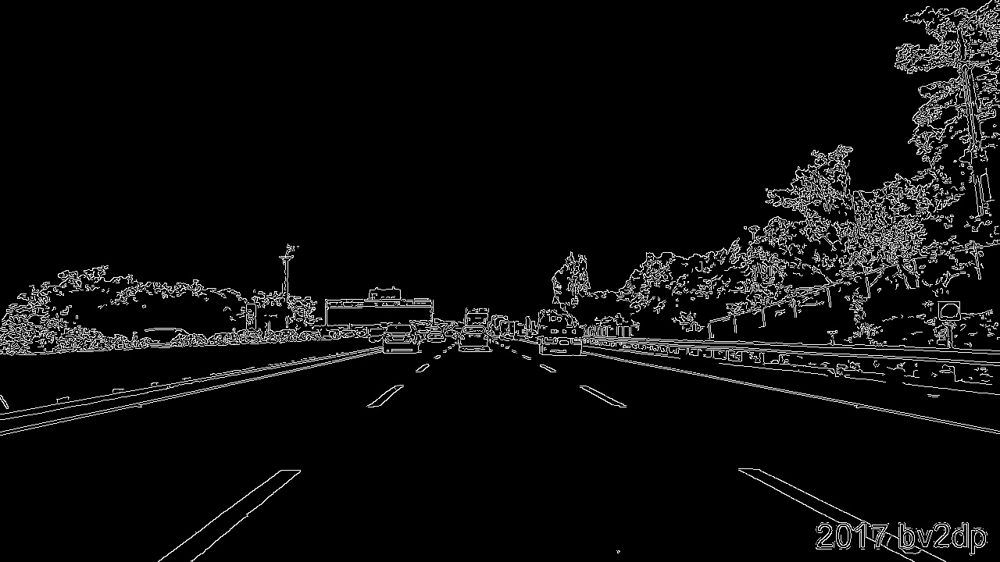
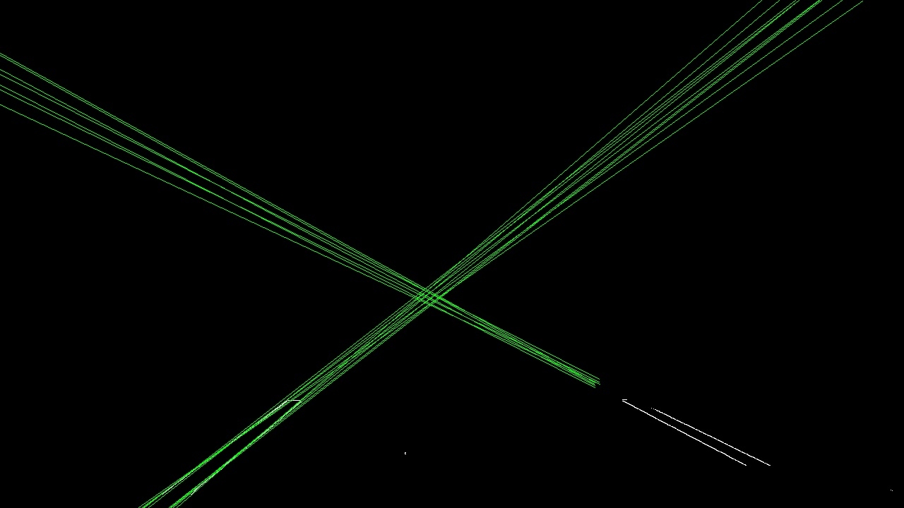
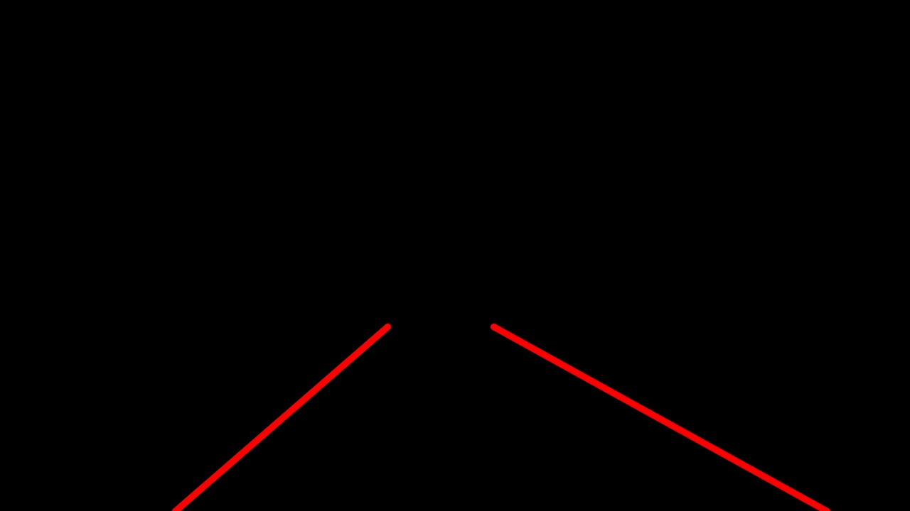
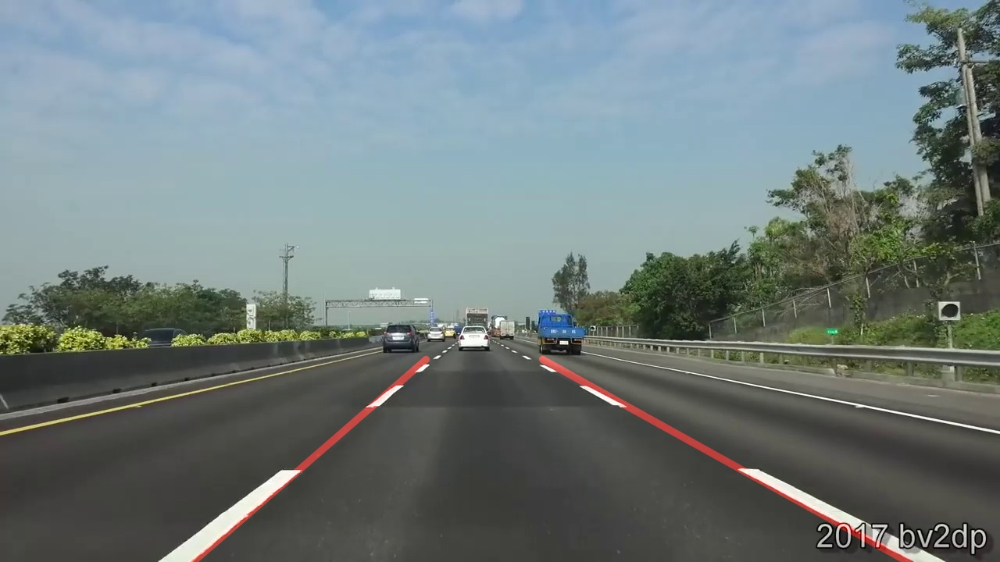

# 自動駕駛實務 作業 1 道路邊線檢測 AutonomousDriving_HW1_LaneLinesDetect

NCKU Practices of Autonomous Driving course homework

## 目標

車道邊線偵測

## 影片素材

1. [Udacity Test Video - solidWhiteRight](https://github.com/udacity/CarND-LaneLines-P1/blob/master/test_videos/solidWhiteRight.mp4)
2. [Udacity Test Video - solidYellowLeft](https://github.com/udacity/CarND-LaneLines-P1/blob/master/test_videos/solidYellowLeft.mp4)
3. [Udacity Test Video - challenge](https://github.com/udacity/CarND-LaneLines-P1/blob/master/test_videos/challenge.mp4)
4. [國道一號 中山高速公路 北向 高雄-基隆 374K-0K 全程 路程景 National Highway No. 1 - Youtube](https://www.youtube.com/watch?v=0crwED4yhBA)

## 成果

**各影片做法相同但參數不同**

1. Udacity Test Video - solidWhiteRight
   完整影片：[solidWhiteRight_result](/output/solidWhiteRight.mp4)
   
1. Udacity Test Video - solidYellowLeft
   完整影片：[solidYellowLeft_result](/output/solidYellowLeft.mp4)
   
1. Udacity Test Video - challenge
   完整影片：[challenge_result](/output/challenge.mp4)
   
1. 國道一號 中山高速公路 北向 高雄-基隆 374K-0K 全程 路程景 National Highway No. 1 - Youtube
   

## 作法

參考：\
[udacity / CarND-LaneLines-P1 - github](https://github.com/udacity/CarND-LaneLines-P1)

### Step 0 讀取影片

```python
    '''
    ## 可設定參數 ##
    SRC_PATH    要處理的影片檔位置
    '''
    cap = cv2.VideoCapture(SRC_PATH)

    # 取得影格(呼叫1次取1張)
    ret, frame = cap.read()
    img = frame
```

### Step 1 轉換

1. 將圖片轉為灰階
   ```python
   img = cv2.cvtColor(img, cv2.COLOR_BGR2GRAY)
   ```
   
2. 經由高斯模糊以避免後面使用 Canny 邊緣偵測時太過敏感
   ```python
   img = cv2.GaussianBlur(img, (9, 9), 0.1)
   ```
   
3. 使用 Canny 邊緣偵測
   ```python
   img = cv2.Canny(img, 100, 200)
   ```
   

### Step 2 遮罩

1. 繪製遮罩區域
   ```python
   mask_ROI = np.zeros([height, width, 1], dtype=np.uint8)
   dots_ROI = np.array([(0, 700), (500, 530), (780, 530), (1280, 700)])
   cv2.drawContours(mask_ROI, [dots_ROI], 0, 255, -1)
   ```
   
2. 套用到原圖
   ```python
   img = cv2.bitwise_and(img, mask_ROI)
   ```
   

### Step 3 直線偵測

1. 使用霍夫變換偵測直線
    ```python
    lines = cv2.HoughLines(img, 1, np.pi / 180, threshold=50)
    ```
    

2. 取得直線 並延伸至裁切區域邊界
    ```python
    rho = lines[i][0][0]
    theta = lines[i][0][1]
    a = np.cos(theta)
    b = np.sin(theta)
    x0 = a * rho
    y0 = b * rho
    pt1 = (int(x0 + 1000*(-b)), int(y0 + 1000*(a)))
    pt2 = (int(x0 - 1000*(-b)), int(y0 - 1000*(a)))

    # y = ma + b

    m = (pt2[1] - pt1[1]) / (pt2[0] - pt1[0])
    b = pt1[1] - (pt1[0] * m)
    pt1_new = (int((720 - b) // m), 720)
    pt2_new = (int((460 - b) // m), 460)
    ```

3. 經由斜率判斷
   - 是否為**車道**
        ```python
        if m < 0.45 and m > -0.5:
            continue
        ```
   - **左邊線** 或 **右邊線**
        ```python
        if m < 0:
            if not LeftUpdate:
                LeftLane = [pt1_new, pt2_new]
                LeftUpdate = True
                continue
            if pt1_new[0] > LeftLane[0][0]:
                LeftLane = [pt1_new, pt2_new]

        elif m > 0:
            if not RightUpdate:
                RightLane = [pt1_new, pt2_new]
                RightUpdate = True
                continue
            if pt1_new[0] < RightLane[0][0]:
                RightLane = [pt1_new, pt2_new]
        ```

### Step 4 繪製車道線
1. 在空白畫面繪製車道線
    ```python
    weight_img = np.zeros((img.shape[0], img.shape[1], 3), dtype=np.uint8)
    if len(LeftLane) > 0:
        cv2.line(weight_img, LeftLane[0], LeftLane[1], (0, 0, 255), 8, cv2.LINE_AA)
    if len(RightLane) > 0:
        cv2.line(weight_img, RightLane[0], RightLane[1], (0, 0, 255), 8, cv2.LINE_AA)
    ```
    

2. 疊加至原圖
    ```python
    outframe = cv2.addWeighted(frame, 1, weight_img, 0.5, 0)
    ```

### Step 5 輸出
```python
out = cv2.VideoWriter(OUT_PATH, cv2.VideoWriter_fourcc(*'mp4v'), 24, (width, height))

...

out.write(outframe)
```
